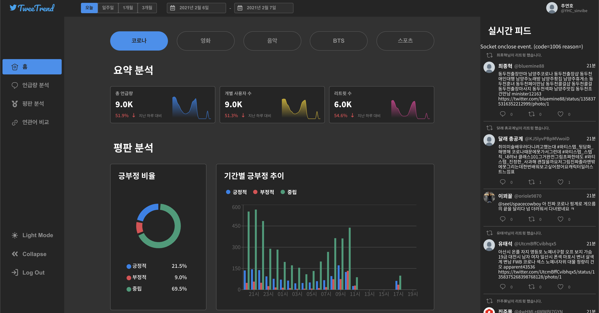
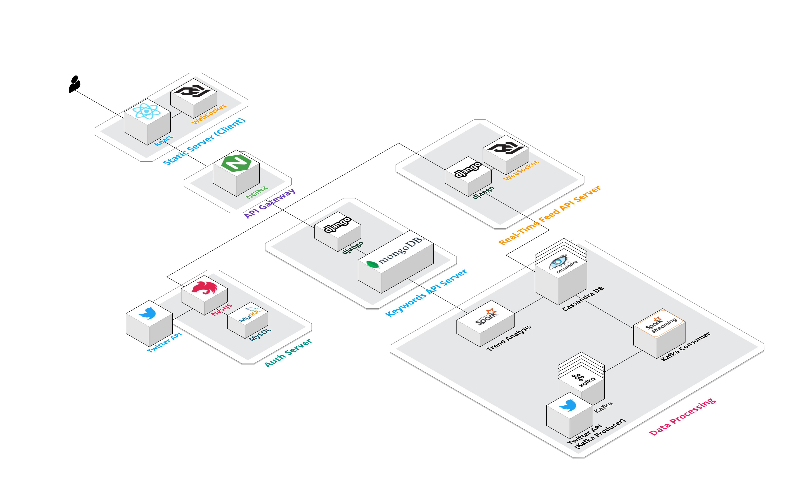

# 

## [Demo](https://drive.google.com/file/d/1uWxr1ZPFfW5JQ7ZooXVwcSWvQPUxD2LF/view?usp=sharing)

  

## Resources

- [Storybook](https://yh9.page/tweetrend)
- [Architecture](https://app.cloudcraft.co/view/60e50b09-952e-47a7-be48-29307faa77bd?key=mX3xEz6obXvNNyA3LV1DPw)
- [Figma](https://www.figma.com/file/3HZ3hzFyIBHORWB6MVqxna/TweetTrend?node-id=34%3A6)
- [Postman - Example Tweets](https://documenter.getpostman.com/view/11536347/TW74jQrc)
- [Postman - TweeTrend](https://documenter.getpostman.com/view/11536347/TW74jQra#intro)

## Architecture

## Tech Stacks

| Area               | Tech Stack                                                                                                                                                                                                                                                                                                                                                                                        |
| ------------------ | ------------------------------------------------------------------------------------------------------------------------------------------------------------------------------------------------------------------------------------------------------------------------------------------------------------------------------------------------------------------------------------------------- |
| Design             |                                                                                                                                                                                                                                      |
| Frontend           |     |
| Linter & Formatter |                                                                                                                                         |
| Mock Server        |                                                                                                                                                                                                                |
| Test               |                                                                                                                                                                                                                                                                                                                    |
| Package Manager    |                                                                                                                                                                                                                                                                                                                  |

## See Also

- [tweetrend-auth-server](https://github.com/younho9/tweetrend-auth-server)

## License

[MIT](/LICENSE)
